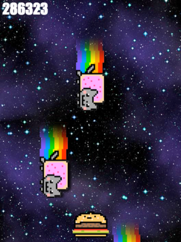

# Nyan-Cat-Project

# Object Oriented Programming Game Project

# Introduction

This project was designed as a way to practice and learn about Object Oriented Programming.

This is also a Nyan Cat Remix. So not Nyan Cat it-self.

Because there is a fair bit of JavaScript in this app, I have split code into more manageable pieces. You wil find all of the code in the `js` folder.

_Because we split the code into many files, I add the `<script>` tags in the right order in the `index.html` file._, it's important not to change the order.

---

## **The game**

This game is called **DODGE THE MONSTERS?!??**. In the game, you play as an anthropomorphic cheeseburger. The only thing you can do is move left or right with the arrows of your keyboard.

The goal of the game is to stay alive as long as possible by avoiding the Monsters who are raining from the sky and trying to _haz_ you. The longer you stay alive, the higher your score!

## Useful Terms

> For those of you who are not familiar with games and/or their terminology.
- **Engine**: games usually run off a `game engine`, an environment that powers the game. In this project it's represented by the `Engine.js` file.
- **Hitbox**: the physical space that an entity occupies in the game. It is usually `rectangular` in shape and `detects collosions` on it's borders.
- **Gameplay**: the way a game is played. This includes the rules and other factors that affect how a player can play the game.
- **Gameboard**: the area on screen where the game is played.
